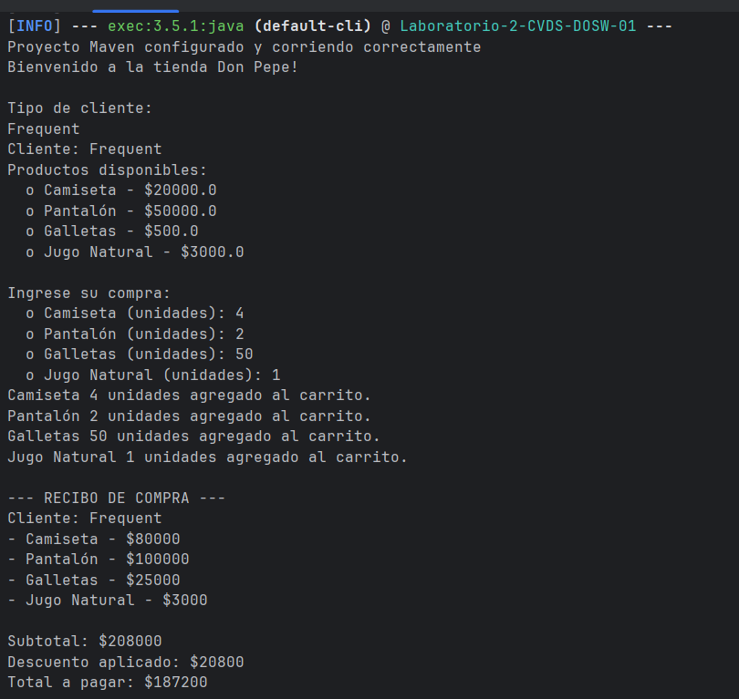
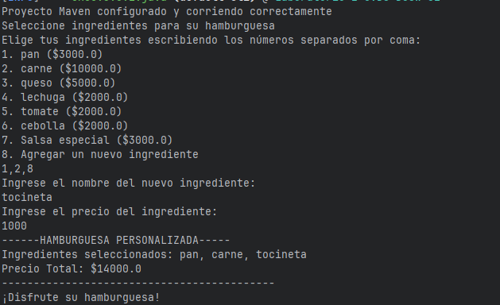
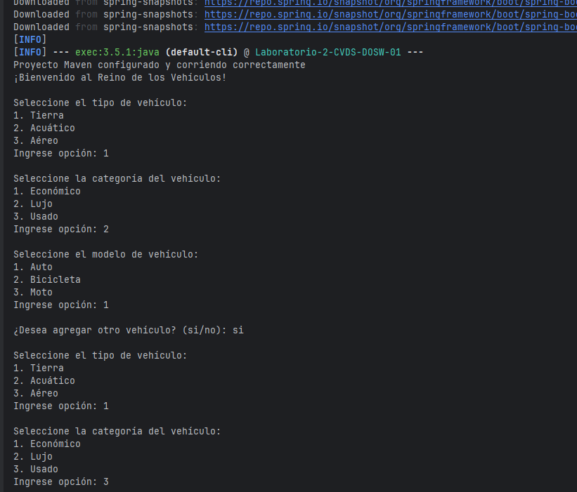
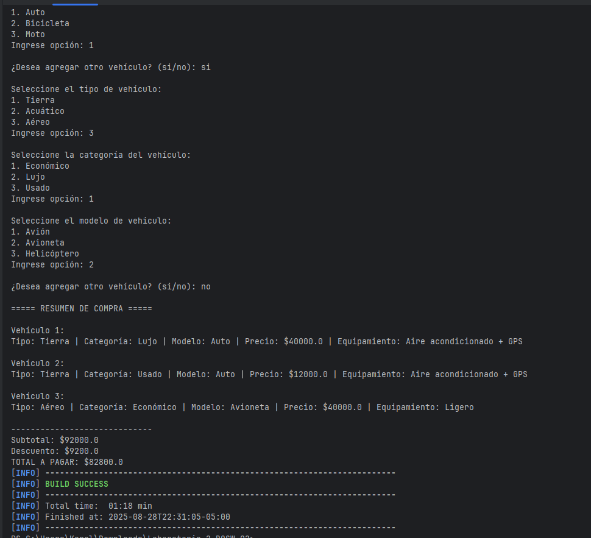
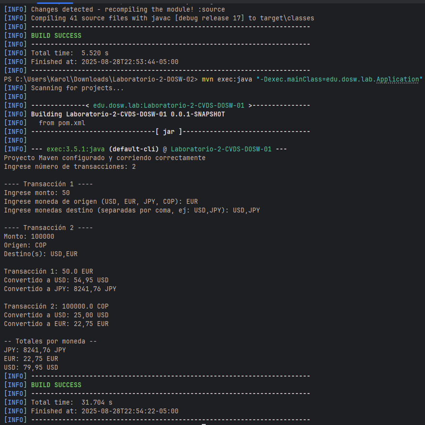
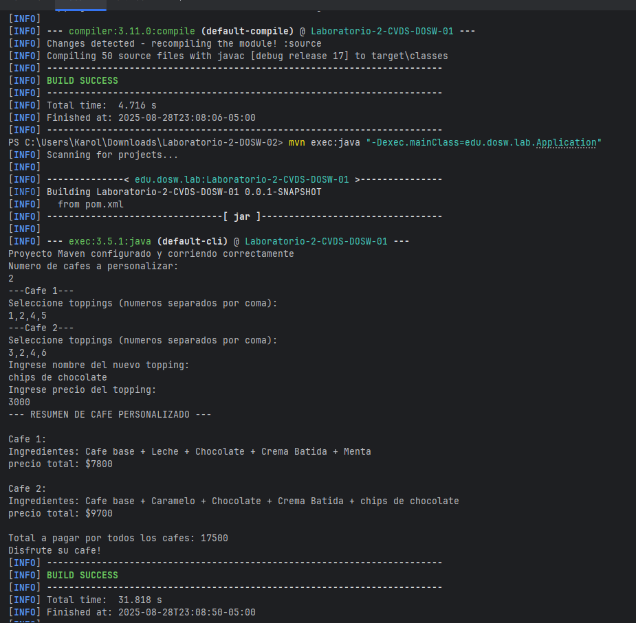
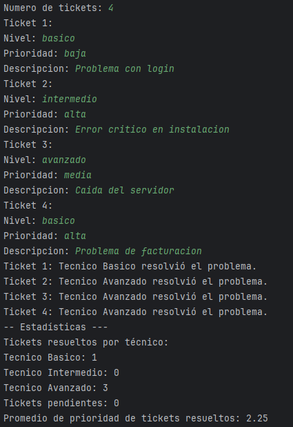
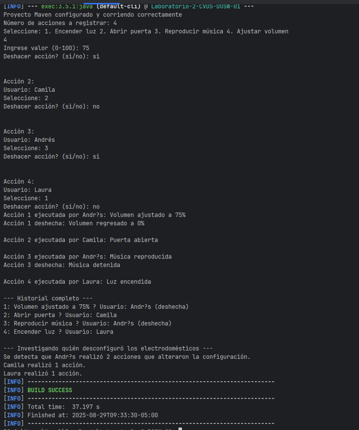

# 🧪 Laboratorio 02 -SOLID, Patrones de Diseño y UML
**Integrantes**
- Carolina Cepeda Valencia
- Marlio Charry Espitia 
- Daniel Palacios Moreno

**Nombre de la rama**
feature/CharryMarlio_CepedaCarolina_PalaciosDaniel_2025-2
---
## ✅ Retos completados

### reto 1: El problema de la tienda de don Pepe

Se hace uso de patrones creacionales.
Los productos, camiseta, pantalón, galletas, que heredan de una clase base Product. Nos basamos en el Factory Method, ya que la clase principal no necesita
conocer como se construyen los productos, solo necesita tenerlos. Por ello, hicimos los productos de 
manera que cada producto concreto sabe como inicializarse con su propio nombre y precio.

Por otro lado, también hicimos uso de una clase abstracta Customer y dos implementaciones concretas, estas serían
Frequentcustomer y NewCustomer y que según una condición en la entrada del usuario, decidiéndose
que tipo de objeto concreto instanciar.

### reto 2: El chef de 5 estrellas

Se hace uso de patrones estructurales. Por ejemplo, usamos el patrón composite a la hora de tener objetos individuales que
en este caso serían los ingredientes y un compuesto de estos mismos que es la hamburguesa.
A su vez, se podría decir que el ingrediente de la clase extra está usando un patrón de diseño
Adapter porque adapta las entradas dinámicas del usuario a un objeto que encaje en la jerarquía de
Ingredient.

### Reto #3 - El Reino de los Vehículos

Patrón de Diseño: Creacional

Patrón Utilizado: Factory Method

Justificación: Se necesita crear diferentes tipos de vehículos según su categoría y modelo, delegando la responsabilidad de la creación a subclases concretas.

Cómo se aplica: Se creó una clase abstracta VehicleFactory y fábricas concretas (LandVehicleFactory, WaterVehicleFactory, AirVehicleFactory) que generan las instancias correctas según la opción elegida por el usuario.

### Reto #4 - La Estafa de la Casa de Cambio

Patrón de Diseño: Comportamiento

Patrón Utilizado: Strategy

Justificación: Permite definir múltiples algoritmos de conversión de divisas y seleccionarlos dinámicamente sin modificar el código principal.

Cómo se aplica: Se implementó una clase abstracta CurrencyConverter con una estrategia común de conversión y clases concretas (USDConverter, EURConverter, JPYConverter, COPConverter) que definen las tasas específicas. El sistema aplica la estrategia correspondiente según la moneda elegida en cada transacción.

### Reto 5: El cafe personalizado

- **Patron de Diseño:** Estructural
- **Patron utilizado:** Composite
- **Justificacion:** El patron Composite se utiliza para tratar objetos individuales y composiciones  de objetos de manera uniforme. En este caso, la clase Cafe actua como un composite que tiene una lista de objetos Topping
- **Como lo aplicamos:** el patron se puede ver usado en la lista de Topping dentro de la clase Cafe, tambine que en el constructor de Cafe se itera Topping para conseguir el precio total del cafe y tambien que los toppings son instancias de subclases de Topping que actuan como hojas en la estructura composite

### Reto 6: El cafe personalizado

- **Patron de Diseño:** Comportamiento
- **Patron utilizado:** Chain of responsability
- **Justificacion:** Este patron se utiliza para procesar solicitudes a traves de una cadena de tecnicos. cada tecnico en la cadena tiene que decidir si puede o no resolver el ticket en su nivel de especialidad y prioridad maxima, si no puede entonces lo pasa al siguinete tecnico en la cadena.
- **Como lo aplicamos:** En este reto se aplico definiendo TicketHandler con los metodos handleTicket y setNext, se implementa la clase de tecnico que implementa esta interfaz para posteriormente crear los tecnicos especifcos, por otra para el hecho de que cada tecnico pueda verificar si puede manejar el ticket o si debe de pasarselo al siguiente en linea, y por ultimo los tickets se procesan a traves de la cadena y logrando saber cual tecnico resolvio el ticket. 

### Reto 7: El control remoto mágico
El patrón de diseño de comportamiento Command se aplicó en este sistema
mediante un invocador, el control remoto, que actúa entre intermediario entre el usuario
y los receptores (electrodomésticos). El ControlRemoto es el encargado de
ejecutar, almacenar y deshacer comandos sin conocer los detalles de implementación
de cada acción. Esto permite desacoplar completamente al invocador de los receptores, facilitando
la extensión del sistema con nuevos comandos sin tener que cambiar el código del control remoto.
