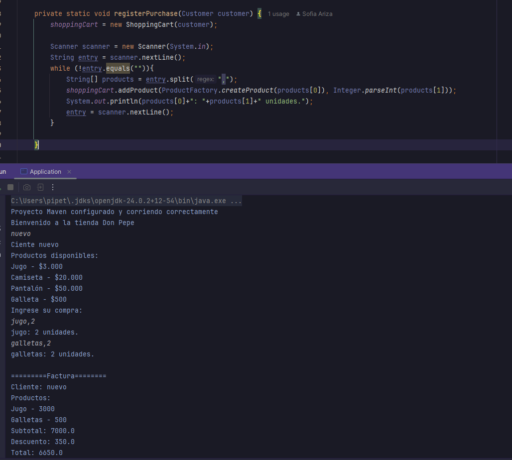
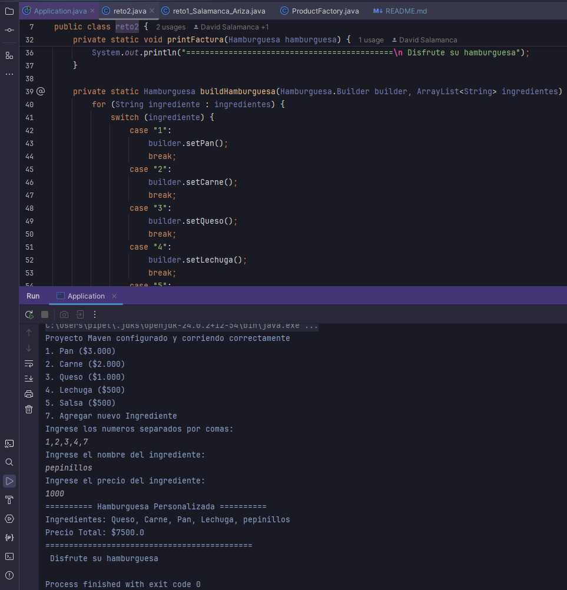
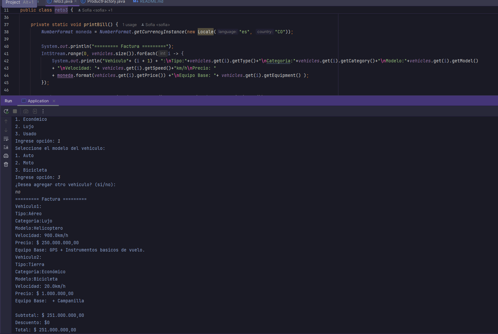
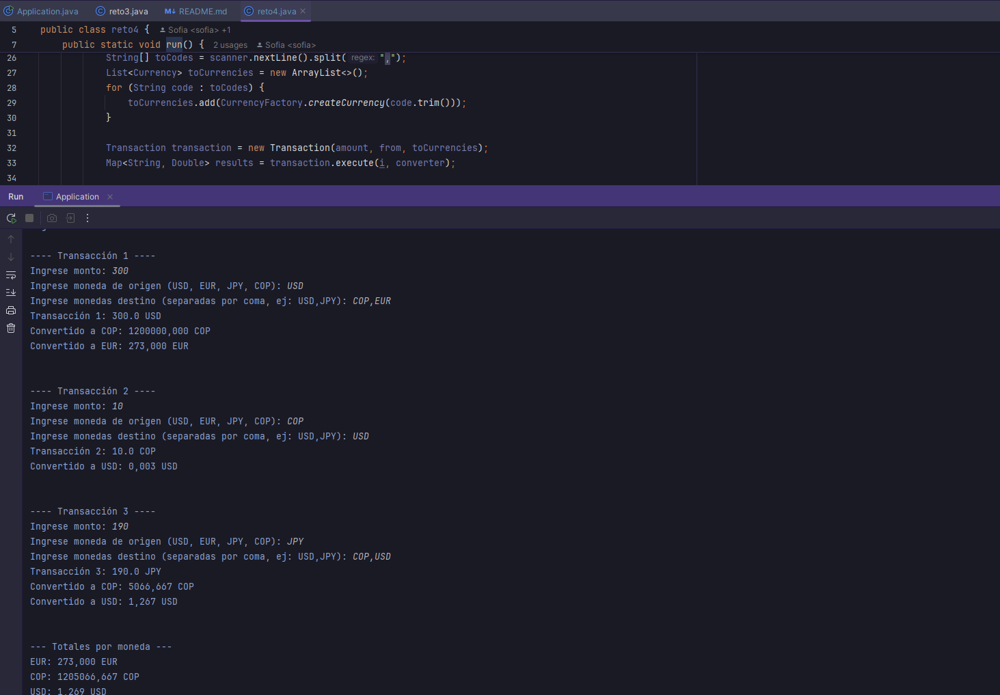
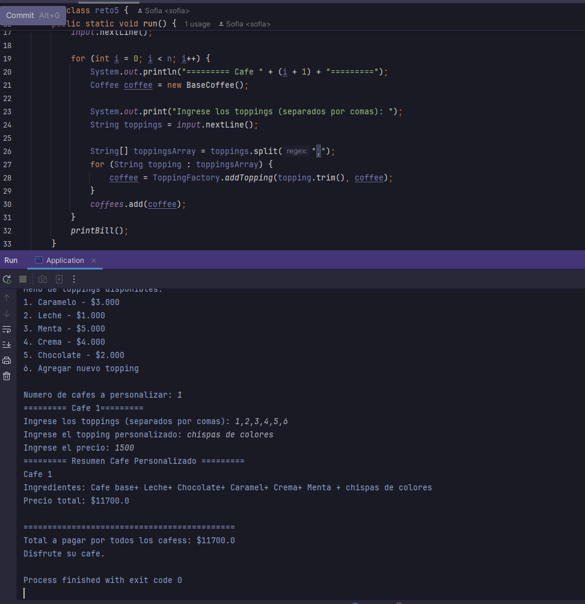
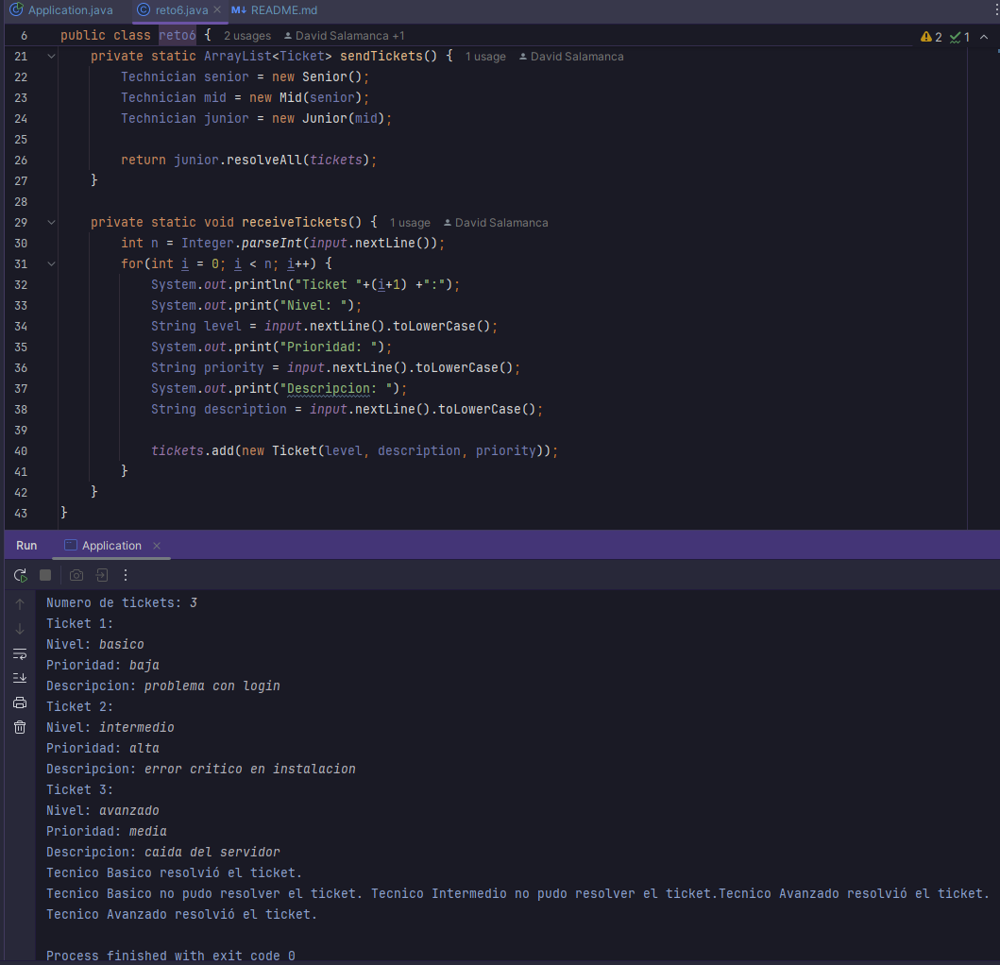
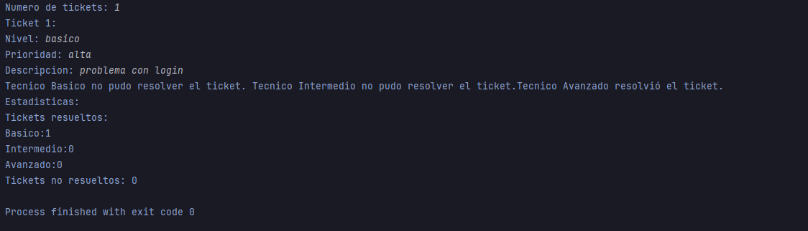

# Laboratorio-2-DOSW-02

**Integrantes**
- David Eduardo Salamanca Aguilar
- Sofia Nicolle Ariza Goenaga

**Nombre de la rama:**
'feature/Salamanca_Ariza_2025-2'

---

## Parte 2

### Retos Completados

#### **1. RETO #1: El problema de la tienda de Don PEPE**

En este reto se implementaron las clases `Customer`, `FrequentCustomer`, `NewCustomer`, junto con productos como `CamisetaProduct`, `PantalonProduct`, `GalletasProduct`, `JugoProduct`.  
La creación de instancias se centralizó en las fábricas `ProductFactory` y `CustomerFactory`, mientras que la clase `ShoppingCart` gestiona los productos comprados.

**Patrón de diseño aplicado:** Factory Method.  
**Principios SOLID utilizados:**
- **SRP (Single Responsibility Principle):** cada clase tiene una responsabilidad clara (cliente, producto, carrito, fábrica).
- **OCP (Open/Closed Principle):** permite añadir nuevos tipos de clientes o productos sin modificar el código existente.

Este diseño favorece la extensibilidad de la tienda con bajo acoplamiento.

---

#### **2. RETO #2: El chef de 5 estrellas**

Se construyó una hamburguesa combinando distintos ingredientes representados en clases como `Pan`, `Carne`, `Lechuga`, `Queso`, `Salsa` y `Tomate`.  
Cada ingrediente hereda de una clase base `Ingredient` y la clase `Hamburguesa` permite su composición.

**Patrón de diseño aplicado:** Builder.  
**Principios SOLID utilizados:**
- **SRP (Single Responsibility Principle):** cada clase de ingrediente representa un único componente.
- **OCP (Open/Closed Principle):** se pueden agregar nuevos ingredientes sin modificar el sistema, solo creando subclases de `Ingredient`.

El diseño facilita la construcción de hamburguesas personalizadas de forma flexible y escalable.

---

#### **3. RETO #3: El Reino de los Vehículos**

Se modelaron jerarquías de vehículos a partir de `Vehicle`, con tipos (`Aereal`, `Aquatic`, `Terrestrial`) y categorías (`Economic`, `Luxury`, `Used`).  
La creación se gestionó mediante fábricas `TypeFactory` y `CategoryFactory`.

**Patrón de diseño aplicado:** Abstract Factory.  
**Principios SOLID utilizados:**
- **OCP (Open/Closed Principle):** permite agregar nuevos tipos o categorías de vehículos sin modificar código existente.
- **LSP (Liskov Substitution Principle):** cualquier subtipo de `Vehicle` puede sustituir a la clase base sin afectar la lógica.

El diseño asegura la creación de familias de vehículos coherentes y fácilmente extensibles.

---

#### **4. RETO #4: La Estafa de la Casa de Cambio**

Se implementó un sistema de conversión de divisas con clases de monedas (`COP`, `USD`, `EUR`, `JPY`) que implementan la interfaz `Currency`.  
La creación se maneja con `CurrencyFactory` y la conversión con `CurrencyConverter`.  
Las tasas de cambio se abstrajeron en `RateProvider` y su implementación concreta `FixedRateProvider`.  
La clase `Transaction` representa operaciones de cambio.

**Patrones de diseño aplicados:**
- Factory Method (creación de monedas en `CurrencyFactory`).
- Strategy (cálculo de tasas de conversión mediante distintos `RateProvider`).

**Principios SOLID utilizados:**
- **DIP (Dependency Inversion Principle):** `CurrencyConverter` depende de la abstracción `RateProvider`, no de implementaciones específicas.
- **OCP (Open/Closed Principle):** se pueden añadir nuevas monedas o estrategias de conversión sin modificar código existente.

El diseño proporciona flexibilidad para soportar múltiples monedas y distintos mecanismos de conversión.

---

#### **5. RETO #5: El Café Personalizado**

En este reto se desarrolló un sistema de bebidas personalizadas a partir de la clase base `Coffee` y el uso de decoradores como `Milk`, `Crema`, `Caramel`, `Chocolate`, `Mint` y `CustomTopping`.  
Cada adición de ingrediente no modifica la estructura principal, sino que se encapsula como un decorador. La clase `ToppingFactory` facilita la creación de estos complementos.

**Patrón de diseño aplicado:** Decorator.  
**Principios SOLID utilizados:**
- **OCP (Open/Closed Principle):** se pueden agregar nuevos toppings sin modificar la clase base `Coffee`.
- **SRP (Single Responsibility Principle):** cada decorador tiene la única responsabilidad de añadir un comportamiento específico.

Este diseño permite personalizar de manera flexible las bebidas con múltiples combinaciones de ingredientes.

---

#### **6. RETO #6: Habla con Soporte Técnico**

Se implementó un sistema de soporte técnico con jerarquías de roles (`Junior`, `Mid`, `Senior`, `Technician`) que gestionan la atención de un `Ticket`.  
Cada nivel de soporte tiene la capacidad de manejar un tipo de solicitud y, en caso de no poder resolverla, delega al siguiente nivel.

**Patrón de diseño aplicado:** Chain of Responsibility.  
**Principios SOLID utilizados:**
- **SRP (Single Responsibility Principle):** cada clase representa un nivel específico de soporte.
- **OCP (Open/Closed Principle):** es posible añadir nuevos niveles de soporte sin modificar la lógica existente.

El diseño asegura que los tickets se gestionen de forma escalonada y flexible, evitando un fuerte acoplamiento entre cliente y manejador.

---

#### **7. RETO #7: El control remoto Mágico**

Se implementó para la solucion del reto una interfaz commando que implementaran todos los patrones disponibles, para poder instanciarlos segun
correspondiera a la peticion del usuario y que ellos mismos guardaran sus atributos. Asi mismo estos comandos guardaban referencias a los
aparatos sobre los que funcionaban. Una clase control remoto ejecutaba dichos comandos despues de ser invocados por el usuario. (Se utilizo una
factory para agilizar la creacion de comandos de acuerdo a la entrada de datos).

**Patrón de diseño aplicado:** Command. Porque las solucitudes debian guardar su informacion (quien la solicito) y la forma de deshacerse, todas
controladas por el control magico del problema, por lo que para llevar el historial, ejecutar y deshacer se aplico este patron.

**Principios SOLID utilizados:**
- **SRP (Single Responsibility Principle):** cada comando tiene la única responsabilidad de ejecutar una accion sobre uno de los dispositivos.
- **OCP (Open/Closed Principle):** es posible añadir nuevos comandos sin modificar la lógica existente.

---

#### **8. RETO #8: El Zoológico de los UML**

En este reto se diseñó un diagrama UML que modela un zoológico.  
Se incluyen las siguientes entidades principales:

- **Animal** como clase base, con atributos como `nombre`, `edad`, `alimentación`, `historial médico`, entre otros, y subclases especializadas (`Mamífero`, `Ave`, `Reptil`).
- **Persona** como clase base para `Cuidadores` y `Visitantes`.
- **Cuidadores** con métodos asociados al cuidado de animales (`bañarAnimal`, `limpiarHabitat`).
- **Visitantes** con interacciones como `darPropina` y `subirFoto`.

**Principios SOLID reflejados:**
- **SRP (Single Responsibility Principle):** cada clase tiene un rol claro en el sistema (representar animales, personas o funciones específicas).
- **LSP (Liskov Substitution Principle):** cualquier subtipo de `Animal` puede sustituir a la clase base sin afectar la funcionalidad.

El diagrama facilita la comprensión de las relaciones jerárquicas y las responsabilidades de cada entidad dentro del sistema del zoológico.
(el diagrama esta en la carpeta correspondiente de docs)