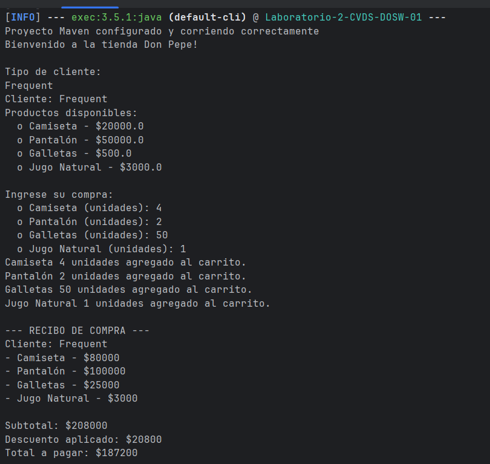
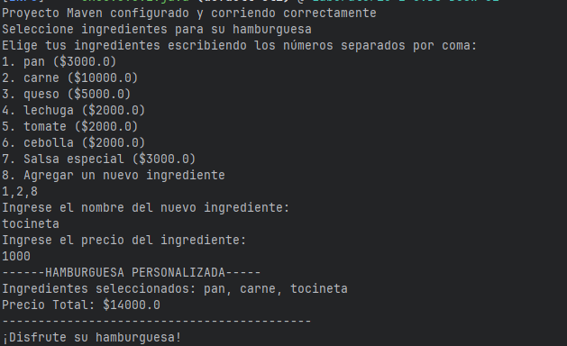

# 🧪 Laboratorio 02 -SOLID, Patrones de Diseño y UML
**Integrantes**
- Carolina Cepeda Valencia
- Marlio Charry Espitia 
- Daniel Palacios Moreno

**Nombre de la rama**
feature/CharryMarlio_CepedaCarolina_PalaciosDaniel_2025-2
---
## ✅ Retos completados

### reto 1: El problema de la tienda de don Pepe

Se hace uso de un patrón creacional ....

### reto 2: El chef de 5 estrellas

Se hace un uso de un patrón estructural...