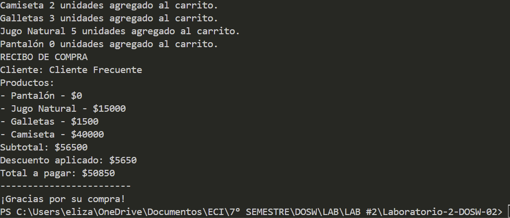
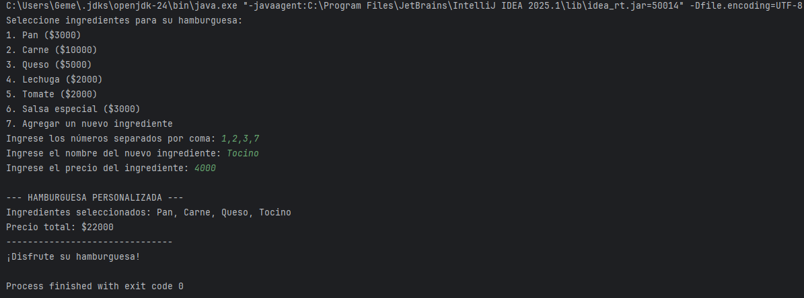
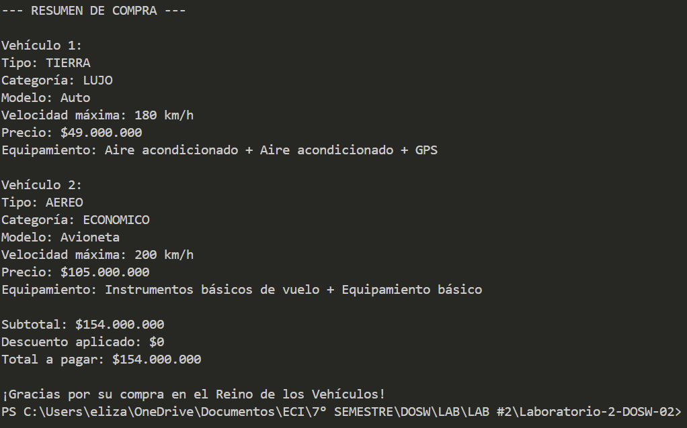
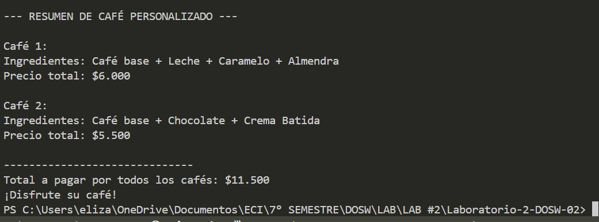
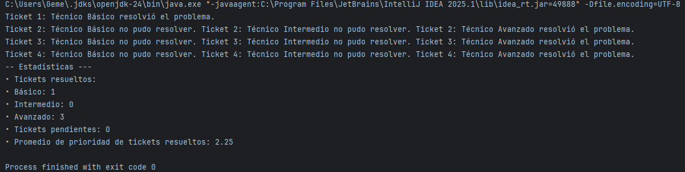

# Laboratorio 02 - SOLID, Patrones de Diseño y UML

**Integrantes:**
- lizabeth Correa
- Juan Sebastian Ortega
- Daniel Rodriguez

**Nombre de la rama:**
"feature/CorreaElizabeth_OrtegaSebastian_RodriguezDaniel_2025-2"

---

# Retos Completados

# 📦 Reto 1 – Carrito de Compras (Descuentos por tipo de cliente)

## 1) Resumen del reto
Construir una aplicación de consola para una tienda que:
- Permite **agregar productos** con cantidades a un **carrito**.
- Selecciona el **tipo de cliente** (Nuevo / Frecuente) y aplica un **descuento**.
- Imprime un **recibo** con detalle de productos, **subtotal**, **descuento** y **total**.

---

## 2) Enfoque de solución (cómo se diseñó)
- **POO + separación por responsabilidades**:
  - `Producto`: datos inmutables de un producto (nombre, precio).
  - `CarritoDeCompras`: agrega productos/cantidades y calcula el **subtotal**.
  - `Cliente` (abstracta) + `ClienteNuevo` / `ClienteFrecuente`: encapsulan el **cálculo de descuento**.
  - `Recibo`: presenta la salida.
- **Extensibilidad**: para nuevos tipos de cliente o reglas de descuento, se crean **nuevas clases** sin tocar el resto del sistema.

## 3) Justificación (principios SOLID y polimorfismo)

### ¿Cómo aplica cada principio SOLID?

- **SRP (Responsabilidad Única):**  
  - `Producto` solo modela datos del producto.  
  - `CarritoDeCompras` solo gestiona ítems y calcula **subtotal**.  
  - `Cliente` y sus subclases solo **calculan descuentos** y reportan su tipo.  
  - `Recibo` solo **imprime** el detalle de la compra.  
  - `Reto1` solo maneja **interacción por consola**.

- **OCP (Abierto/Cerrado):**  
  - Para agregar un **nuevo tipo de cliente** **no** se modifican clases existentes; se añade una nueva subclase de `Cliente`.  
  - También pueden agregarse **nuevos productos** sin cambiar la lógica del carrito o del recibo.

- **LSP (Sustitución de Liskov):**  
  - Cualquier subclase de `Cliente` (`ClienteNuevo`, `ClienteFrecuente`) puede sustituir a `Cliente` sin romper el comportamiento esperado (siempre entrega un descuento válido a partir del subtotal).

- **ISP (Segregación de Interfaces):**  
  - La “interfaz” expuesta por `Cliente` (clase abstracta) es mínima y relevante: `calcularDescuento(double)` y `getTipoCliente()`. Las clases consumidoras no dependen de métodos que no necesitan.

- **DIP (Inversión de Dependencias):**  
  - El recibo y el flujo principal dependen de la **abstracción** `Cliente`, lo que permite intercambiar libremente la estrategia de descuento.

### ¿Cómo se aplica el polimorfismo?

- **Polimorfismo por herencia/overriding**: `ClienteNuevo` y `ClienteFrecuente` **sobrescriben** `calcularDescuento(...)`.  
- **Uso polimórfico**: el código del recibo **no sabe** qué tipo concreto de cliente se está usando, solo invoca `cliente.calcularDescuento(subtotal)` y el método correcto se resuelve en tiempo de ejecución.  
- **Selección en tiempo de ejecución**: en `Reto1`, según la opción del usuario, se instancia la subclase correspondiente y se trata **uniformemente** como `Cliente`.

---

## 4) Evidencias

---

# 👨‍🍳  RETO #2: El chef de 5 estrellas
### Evidencias

Para este ejercicio se aplicó el patrón Builder, dado que necesitabamos uno que nos permitiera construir objetos mediante un paso a paso. Se escogió este modelo porque una 
hamburguesa puede tener diferentes combinaciones de ingredientes (pan, carne, queso, vegetales, salsas) y no todos son obligatorios, es decir no manejamos unos parametros especificos.
La clase HamburgerBuilder agrega ingredientes de forma encadenada y luego genera el objeto final con build(), mientras que Hamburger 
representa el producto completo y calcula el precio con streams. Así, el patrón se ve reflejado en la flexibilidad para 
personalizar la hamburguesa y en la claridad del proceso de construcción.

---

# 🚗 RETO # 3 – El Reino de los Vehículos

## 1) Resumen del reto
La concesionaria **Reino de los Vehículos** vende medios de transporte **de tierra, acuáticos y aéreos**, con categorías **Económico, Lujo y Usado**.  
Cada categoría **modifica** las características: **velocidad máxima, comodidad/equipamiento y precio**.  
El usuario puede **elegir X vehículos** (tipo + modelo + categoría), **generarlos** y **pagar en caja**. El **total** se calcula con **Streams**.

## 2) Enfoque de solución
- **POO + SOLID:** separamos el **modelo** (vehículos y especificaciones) de la **aplicación de consola** (entrada/salida).  
- **Especificaciones base:** cada modelo tiene velocidad, precio y equipamiento *base*.  
- **Ajustes por categoría:** una política transforma esas especificaciones según **Económico/Lujo/Usado**.  
- **Extensibilidad:** agregar un modelo o una categoría **no exige cambiar** las clases existentes (OCP).

## 3) Patrones de diseño

**Patrón de Diseño (categoría):**  
- **Creacionales:** Abstract Factory  
- **Comportamentales:** Strategy

**Patrón Utilizado:**  
- **Abstract Factory** para crear vehículos por **familia** (Tierra/Acuático/Aéreo) sin acoplar la app a clases concretas.  
- **Strategy (Política de Categoría)** para ajustar velocidad, precio y equipamiento según **Económico/Lujo/Usado** sin tocar el código de los modelos.

### Justificación
- El dominio combina **familias** (tipo de vehículo) con **variantes** (categoría).  
- **Abstract Factory** separa la construcción por familia; **Strategy** encapsula la lógica de ajustes por categoría → se cumple **SRP** y **OCP**.  
- Agregar **nuevos modelos** o **nuevas categorías** no rompe lo existente (bajo acoplamiento).

### Cómo se aplica en el código
- **Modelo base:** `Vehiculo`, `VehiculoSimple`, `Especificaciones`.  
- **Fábricas:** `FabricaTierra`, `FabricaAcuatico`, `FabricaAereo` implementan `FabricaVehiculos` y crean el modelo solicitado.  
- **Políticas de categoría:** `Economico`, `Lujo`, `Usado` (implementan `PoliticaCategoria`) transforman las especificaciones base antes de instanciar el vehículo final.  
- **Consola:** `AplicacionVehiculos` guía al usuario (tipo → categoría → modelo), agrega al **carrito** y muestra **resumen** + **total** (Streams).

---

## 4) Evidencias

----

# ☕ Reto 5 – Café Personalizado

## 1) Resumen del reto
La **Cafetería Creativa** permite a los clientes personalizar su café agregando **toppings, salsas y complementos**.  
Cada topping tiene un **precio adicional** y puede combinarse con otros.  
El sistema debía permitir que se agregaran **nuevos toppings sin modificar la base del café**, cumpliendo con **POO, principios SOLID** y usando **Streams** para calcular el total cuando hay varios cafés.

---

## 2) Enfoque de solución
- **Modelo POO:** se creó una **interfaz `Cafe`** con operaciones básicas: `obtenerDescripcion()` y `calcularCosto()`.  
- **Componente base:** `CafeBase` representa el café simple, con un precio base fijo.  
- **Decoradores:** cada topping (`Leche`, `Chocolate`, `Caramelo`, etc.) implementa la abstracción `DecoradorTopping` y agrega su propio precio + descripción.  
- **Extensibilidad:** para nuevos toppings basta con crear una clase que extienda `DecoradorTopping` (cumple OCP). 

## 3) Patrón de diseño

**Patrón de Diseño (categoría):**  
- **Estructurales**

**Patrón Utilizado:**  
- **Decorator**

### Justificación
- Permite añadir toppings a un café sin modificar la clase base.  
- Cumple con el **Principio Abierto/Cerrado (OCP)** de SOLID: podemos añadir nuevos toppings creando nuevas clases, sin alterar el código existente.  
- Cada topping es un **decorador** que envuelve un `Cafe`, extiende su descripción y aumenta el costo final.  

### Cómo se aplica en el código
- `Cafe` es la interfaz principal.  
- `CafeBase` representa el café simple.  
- `DecoradorTopping` es la clase abstracta que implementa `Cafe` y envuelve otro `Cafe`.  
- Clases como `Leche`, `Chocolate`, `Caramelo`, `Menta` y `ToppingPersonalizado` implementan el patrón como **decoradores concretos**.  
- `La clase Reto5 (main)` construye dinámicamente cada café según las elecciones del usuario y luego calcula el total con Streams.

## 4) Evidencias

---

# 🛠️ RETO #6: Habla con Soporte Técnico
### Evidencias

En este ejercicio utilizamos el patrón Chain of Responsibility, que se ve reflejado en la clase abstracta Technician, donde cada técnico decide si puede resolver un
ticket; si no, lo pasa al siguiente con next.resolve(), con esto se permite que los tickets se procesen en cadena sin depender de un técnico específico.Se escogió 
este patrón dado que el problema maneja distintos niveles y prioridades, por lo que debería ser flexible el escoger quién resuelve cada caso, dejando los que no puedan ser atendidos como pendientes para escalar.

## Preguntas Iniciales

**1. ¿Qué ventaja ofrece el polimorfismo en el diseño de clases frente al uso de múltiples condicionales para determinar el comportamiento de un objeto?**

Permite que cada clase implemente su propio comportamiento sobrescribiendo métodos, eliminando if/else o switch. Esto hace el código más legible, extensible y fácil de mantener.

**2. ¿Por qué una clase inmutable puede mejorar la seguridad?**

Un objeto inmutable no cambia después de creado. Así se evita que otras partes del sistema o hilos modifiquen su estado de forma inesperada, reduciendo errores de concurrencia y manipulaciones inseguras.

**3. ¿Qué problema podría aparecer en un sistema si los atributos de las clases se mantienen públicos en lugar de privados con getters y setters controlados?**

Cualquier código puede modificar esos atributos sin control. Esto rompe encapsulación, genera estados inválidos y dificulta depuración. Con getters/setters podemos validar, proteger o notificar cambios.

**4. ¿Según el principio de Abierto/Cerrado, como deberíamos modificar el sistema si queremos añadir una nueva funcionalidad sin alterar el código existente?**

El sistema debe estar abierto a extensión pero cerrado a modificación. Para añadir funcionalidades se crean nuevas clases o implementaciones que extienden/implementan interfaces existentes, sin alterar código ya probado. Ejemplo: añadir una nueva forma de pago creando una nueva clase PaypalPayment que implemente Payment, en lugar de modificar un switch.

**5. ¿Por qué es importante que una clase cumpla con el Principio de única responsabilidad y que ejemplo sencillo podrías dar donde se vulnere?**

Una clase debe tener un único motivo de cambio.
Ejemplo: una clase Report que genera datos y los imprime en PDF. Si cambia el formato o la lógica de negocio, la misma clase se rompe por dos motivos distintos. Lo correcto sería separar en ReportGenerator y ReportPrinter.

**6. ¿Qué es y porque usamos el pom.xml?**

Archivo de configuración de Maven. Define dependencias, plugins, versión de Java, empaquetado, etc. Permite reproducibilidad del proyecto y automatiza la construcción.

**7. ¿Qué diferencia hay entre mvn compile, mvn package y mvn install?**
**-mvn compile:** compila código fuente a .class.
**-mvn package:** compila + empaqueta en un .jar o .war.
**-mvn install:** compila + empaqueta + instala el artefacto en el repositorio local     (~/.m2/repository) para que otros proyectos lo usen.

**8. ¿Qué diferencia existe entre una interfaz y una clase abstracta?**
**Interfaz:** solo define contratos. Desde Java 8 puede tener métodos default y static. No tiene estado (atributos salvo constantes).

**Clase abstracta:** puede definir métodos abstractos y concretos, además de atributos. Permite compartir implementación parcial.

**Diferencia clave:** una clase puede implementar múltiples interfaces pero solo extender una clase abstracta.
