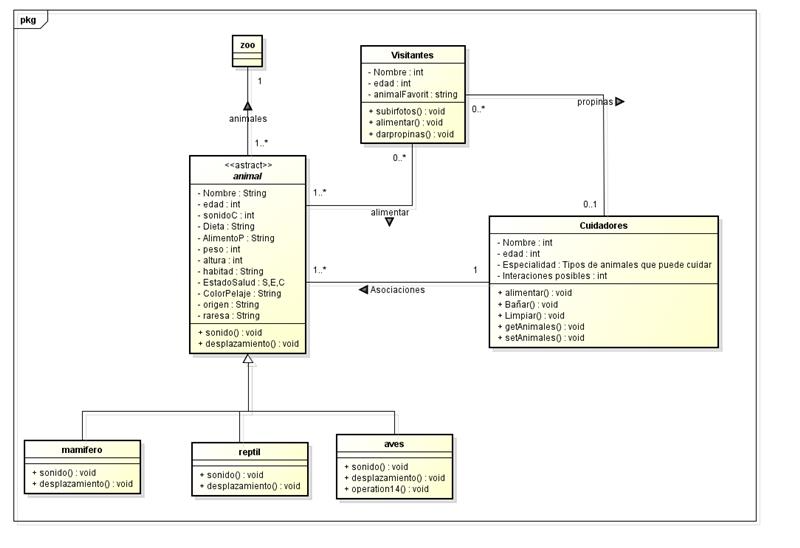

# Laboratorio 02 -SOLID, Patrones de Diseño y UML
**Integrantes**
- Julian Eduardo Arenas Alfonso
- Ramirez Alvarez Tomas Felipe
- Manuel Alejandro Guarnizo 

**Nombre de la rama**
feature/guarnizo_ramirez_arenas_2025-2
---
## Retos completados

# Reto 8
**Descripción**

Aplicando los diseños y conocimientos en diagramas, patrones, se realize el diseño de una solución.
para graficar el flujo de funcionamineto del zoologíco.

Creamos 4 clases principales, Zoo, la cual es la clase principal, alución al zoológico. Creamos la 
interface animal, la cual tiene herencias de especies (Mamiferos, Reptiles y Aves), los cuales son 
una herencia de dicha clase abstracta. 
Añadimos la clase cuidadores, la cual se relaciona con los animales en su labor (alimentar, limpiar y bañar).
Por ultimo, se añadio la clase visitante, la cual se relaciona con los animales (alimentandolos),
y los cuidadores (dandoles propinas).
Añadimos metodos relevantes en las interacciones de los animales.
