# Laboratorio 02 -SOLID, Patrones de Diseño y UML
**Integrantes**
- Julian Eduardo Arenas Alfonso
- Ramirez Alvarez Tomas Felipe
- Manuel Alejandro Guarnizo 

**Nombre de la rama**
feature/guarnizo_ramirez_arenas_2025-2
---
## Retos completados
---

# RETO 1

**Descripción**

El objetivo de este reto es poder lograr crear un sistema de compras para una tienda, donde los clientes puedan agregar
sus productos dentro de un carrito de compras, el cual les calculara el subtotal, aplicara los descuentos que se 
tengan, dependiendo el cliente, t por ultimo generar un recibo con toda la información de su compra.

Las opciondes del usuarios son:
- Ingresar que tipo de cliente es (nuevo o viejo).
- Agregar uno o más productos al carrito de compras.
- Ver el recibo con toda la informacion de su compra (descuento, total y productos).

Su estructura fue:
- **Producto:** Es la clase que representa el producto, teneindo el nombre y precio.
- **ItemCarrito:** Esta es la clase que asocia un producto con su calidad.
- **CarritoCompras:**  Esta clase gestiona todos los productos agregados y calcula el subtotal.
- **Cliente:** Esta clase define al cliente, la cual se encargara de seleccionar los descuentos que este tenga.
- **EstrategiaDescuento:** Esta clase es la interfaz que define el metodo para aplicar los descuentos.
- **Recibo:** Esta clase se encarga de generar el recibo con toda la información de su compra.
- **DescuentoClienteFrecuente:** Aca estan las implementaciones concretas para la estrategia de descuento.
- **DescuentoClienteNuevo:** Aca estan las implementaciones concretas para la estrategia de descuento.
- **Reto1:** Esta es la clase principal, la cual gestiona el flujo de todo el programa y la interfaz del usuario.

Aca se usaron algúnos patrones como el patrón, Strategy, el cual encapsula las diferntes formas de generar descuento 
a los clientes.
También se uso el Factory Method, la cual se puede ver en la clase cliente, que instancia automáticamente la estrategia 
de los descuentos adecuados, dependiento el tipo de cliente.
Tambien se uso el principio D (Dependency inversion), ya que tanto la clase cliente como recibo, trabajan como
abstracciones de la clase estrategiaDescuento, para no tener que depender de implementaciones concretas.

# Reto 2
**Descripción**

Este proyecto simula un restaurante donde el usuario puede crear su hamburguesa personalizada**, seleccionando entre 
ingredientes predefinidos o agregando nuevos a gusto. aplicando los principios solid, Patrón aplicado: Builder 
(o “Constructor” para objetos complejos), puede ver también un poco de Encapsulamiento y Separados cada clase tiene 
responsabilidad clara.
El programa calcula el precio total y muestra un resumen detallado del pedido.
Está pensado como un ejemplo práctico de **estructuras de datos**, **POO en Java** y **interacción por consola**.
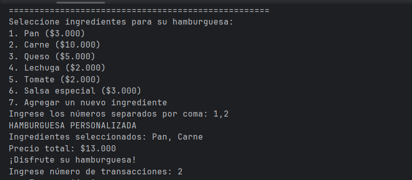
Hemos creado algunas clases para que sea extensible y prospero para futuras actualizaciones
- **Chef:** Clase principal, inicia la ejecución y controla la interacción con el usuario
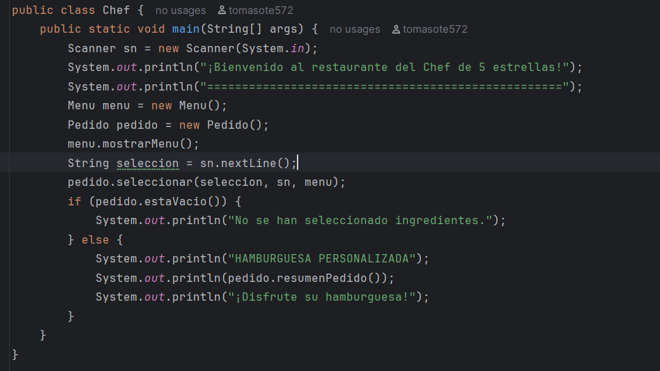
- **Reto2:** Clase auxiliar para iniciar el programa desde otro punto
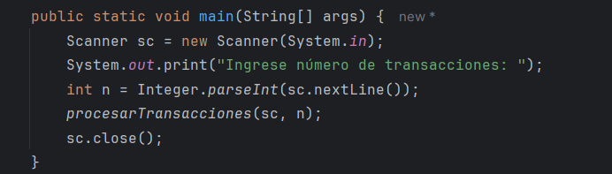
- **Ingrediente:** Representa un ingrediente con nombre y precio
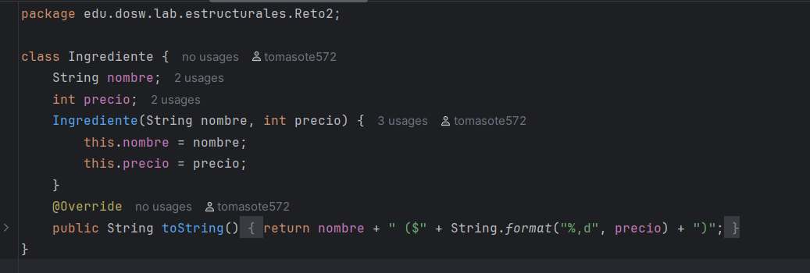
- **Menu:**  Contiene los ingredientes base y muestra el menú al usuario
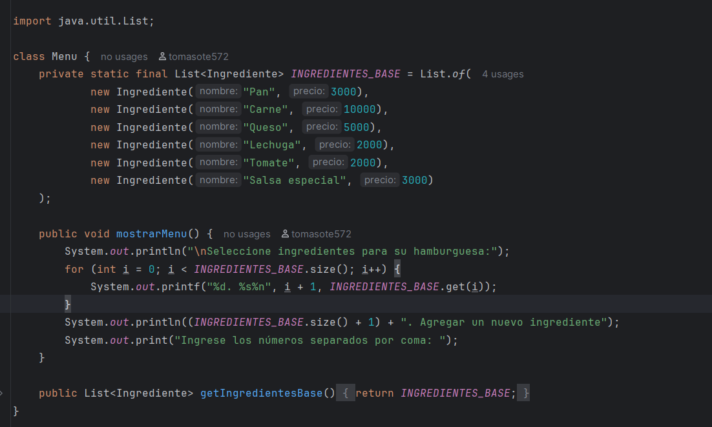
- **Pedido:** # Gestiona la selección de ingredientes y el cálculo de precio total
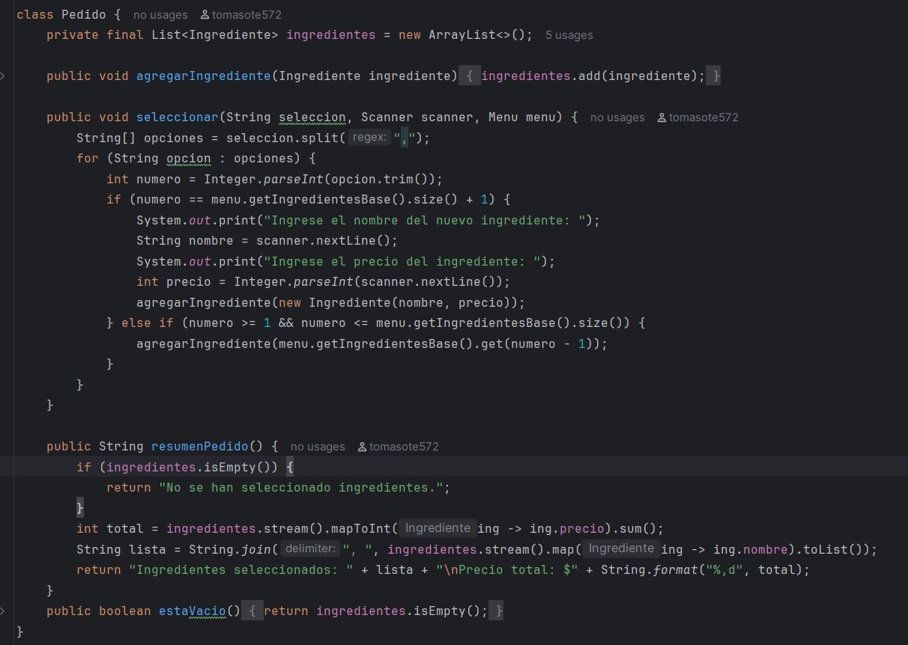
---
# Reto 3

**Descripción**

El objetivo de este reto era crear un sistema que permitiera realizar una compra
seleccionando los diferentes tipos de vehículo que hay (de tierra, acuático, aéreos)
en sus distintas categorías (económico, lujo y usado).

Este programa que realizamos para el reto 3, funciona como una tienda, la cual se
llamo "Reino de los vehículos", donde el usuario puede realizar diferentes acciones
como:

* Escoger el tipo de vehículo que quiere comprar, siendo de tierra, acuático y aéreo.
* Escoger la categoría para el vehículo que le interesa, siendo económica, lujo o usado.
* Escoger el modelo de su vehículo, siendo un auto, bicicleta, moto, etc... .
* Escoger más de un vehículo para su carrito.
* Generarle un recibo al usuario donde pueda ver el total de su compra.

Para este reto se uso la siguiente estructura:
* Vehículo: la cual representa a todos los vehículos.
* Clases implementadas a vehículo: auto, bicicleta, moto, avión, avioneta.
  helicóptero, velero, lacha, jetski.
* VehículoFactory: esta es la clase interfaz de la fabrica.
* Clases implementadas a fabrica: VehiculoEconomicoFactory, VehiculoLujoFactory,
  VehiculoUsadoFactory.
* Reto 3: Esta es la clase principal que ya maneja toda la lógica del menú,
  el carrito de compras y el recibo.

Se uso el principio SOLID y el patrón de diseño Abstract Factory.

---
# Reto 4
**Descripción**

Este proyecto simula una casa de cambio de divisas, donde se pueden procesar múltiples transacciones, convertir montos 
entre distintas monedas y mostrar los totales por moneda al finalizar.
Se manejan las monedas USD, EUR, JPY y COP, considerando sus tasas de cambio y la cantidad de decimales apropiada para
cada una. Además, se aplica un formato especial de visualización, por ejemplo, separadores de miles para JPY y reemplazo 
de punto por coma para EUR.
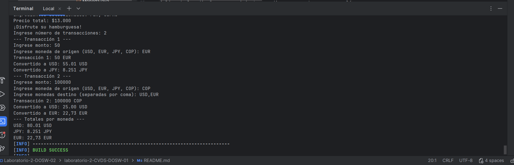
- Utilizamos 5 clases para desarrollar este ejercicio de la mejor manera y que fuera con los principios de la clase como lo
son polomorfismo y principios solid

**CasaDeCambio**

-  Clase principal que inicia el programa,Pide al usuario el número de transacciones.
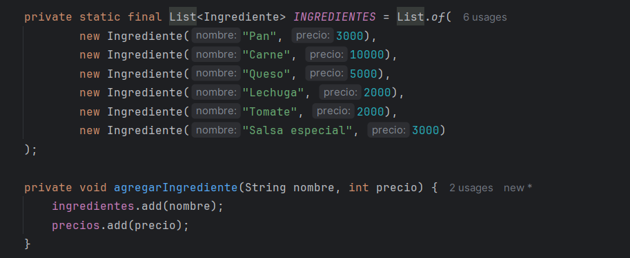

**Reto4**

- Funcion: Alternativa a CasaDeCambio con manejo de errores.Igual que CasaDeCambio, pero envuelto en un try-catch.
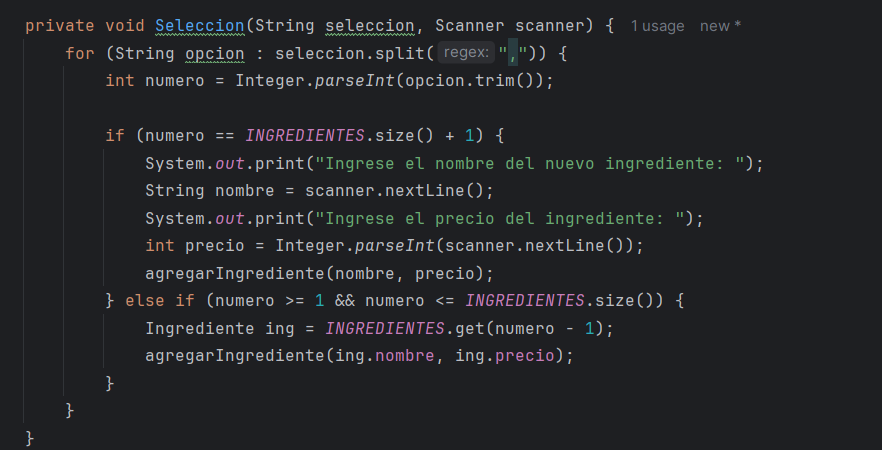

**Transaccion**

- Núcleo del programa, maneja las transacciones y conversiones. Pide monto, moneda de origen y monedas destino.
Convierte el monto a USD como base, luego a las monedas destino usando las tasas de cambio de Moneda.
Captura excepciones y muestra un mensaje amigable si algo falla durante la ejecución.
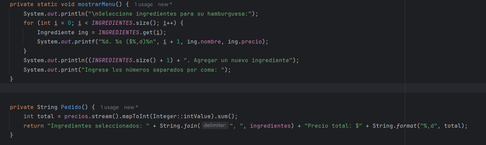

**FormatoMoneda**

- Funcion: Formateo de salida de los montos según la moneda. Mejora la legibilidad de los resultados.
Crea un objeto Transaccion y llama a procesarTransacciones para manejar la lógica de conversión.
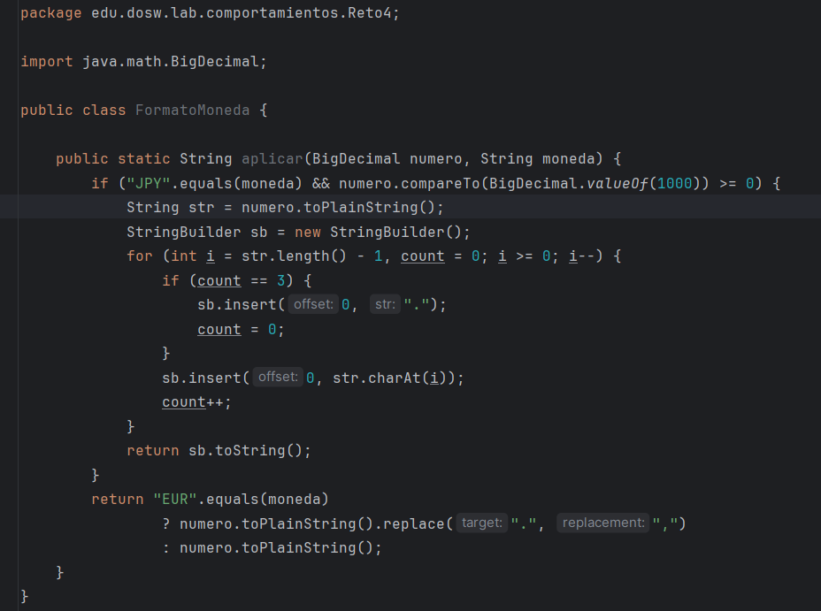

**Moneda**

- Configuración de monedas y reglas de cálculo.Centraliza la información de monedas, lo que hace más fácil 
actualizar tasas o formatos en el futuro.
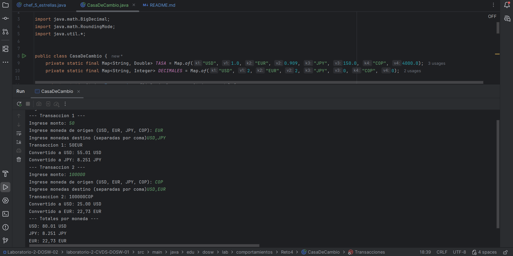
- El funcionamiento en conjunto de estas clases hace que el ejercicio no solo sea preciso sino extensible a futuras
mejoras y cambios
- Patrón aplicado: Strategy (estrategia de formato)actúa como estrategia para formatear cada moneda de manera diferente.

# Reto 5
**Descripcion**

El objetivo de este reto era poder crear un sistema, el cual permita a los usuarios personalizar sus cafes con
diferentes ingredientes, siendo flexible y sin tener que modificar la clase principal del cafe cada vez que se quisiera
añadir un nuevo topping.

Las opciones del usuario son:
- Escoger la cantidad de cafes que quiere personalizar.
- Seleccionar los ingredientes extras que desea adicionar a su cafe.
- Crear un ingrediente personalizado a su gusto (nombre, precio).
- obtener un recibo con los cafes que escogio, los ingredientes extras y el total a pagar.

Su estructura fue:

**Cafe:** Es la cual representa todos los cafes.
**Cafe simple:** Esta es una clase la cual es el cafe simple, sin nada personalizado.
**CafeCambiable:** Esta es una clase abstracta la cual permite personalizar el cafe
**ExtraPersonalizado:** Esta es una extencion de la clase cafeCambiable, añade los ingredientes y el costo del cafe.
**Reto5:** Esta es la clase principal la cual maneja ya todo el flujo del programa.

Aca se uso el patron de diseño estructurar (decorador), el cual permite añadir de manera dinamica las funcionalidades
de un objeto, sin modificar la clase inicial.
También se uso el principio O (Open/close), el cual es un sistema abierto a extenciones pero cerrada a modificaciones.
Y por ultimo se uso el principio D (dependencia), ya que el codigo trabaja con la abstraccion de la clase cafe, y no de clases 
especificas, asi reduciendo el acoplamiento.

# Reto 6
**Descripción**

El objetivo de este reto, es crear o implementar un sistema de soporte técnio, en el cual los tickets que crearón 
los usuarios seran atendidos según el niver de dificultad y prioridad.
Los tickets deberan pasar por cada cadena tecnica, que son básica, intermedia y avanzada. Hasta que se úeda resolver.

Las opciones del usuarios son:
- Ingresa la descripción del problema.
- Define el nivel del ticket (básico, intermedio y avanzado).
- Define la prioridad del ticket (Baja, media y alta).
- Registra uno o mas tickets.
- Ver el reporte de cada ticket.

Su estructura fue:
- **NivelDificultad:** En este se representa el nivel del problema (básico, intermedio y avanzado).
- **Prioridad:** Aca se representa la prioridad del ticket (baja, media, alta).
- **Ticket:** Esta clase modela el ticket, con su descripción, dificultad, prioridad y estado, que seria
- resuelto o pendiente.
- **Tecnico:** Esta seria la interfaz, la cual define el comprotamiento de cada uno de los tecnicos.
- **TecnicoBásico:** Atiende a los tickets de su nivel o escala.
- **TecnicoIntermedio:** Atiende a los tickets de su nivel o escala.
- **TecnicoAvanzado:** Atiende a los tickets de su nivel o escala.
- **SoporteTecnico:** Este se encarga de configurar la cadena de responsabilidad entre los técnicos 
y también procesa los tickets.
- **Reto6:** Esta es la clase principal, la cual gestiona la interaccion con el usuario, crea los tickets
- y las estadísticas.

Se usaron algunos patrones como el patrón Chain of Responsibility, ya que cada técnico atiende solo a los tickets
de su nivel, y si no lo puede resolver, escala al siguiente técnico como una cadena.

-----
# Reto 8
**Descripción**

Aplicando los diseños y conocimientos en diagramas, patrones, se realiza el diseño de una solución.
para graficar el flujo de funcionamineto del zoologíco.

Creamos 4 clases principales, Zoo, la cual es la clase principal, alución al zoológico. Creamos la 
interface animal, la cual tiene herencias de especies (Mamiferos, Reptiles y Aves), los cuales son 
una herencia de dicha clase abstracta. 
Añadimos la clase cuidadores, la cual se relaciona con los animales en su labor (alimentar, limpiar y bañar).
Por ultimo, se añadio la clase visitante, la cual se relaciona con los animales (alimentandolos),
y los cuidadores (dandoles propinas).
Añadimos metodos relevantes en las interacciones de los animales.

**SOLID** 
Para implementar parte de los pilares de solid utilizamos s(responsabilidad unitaria) que cada clase tienen
que hacer solo lo que tiene que hacer,la o(open-clouse) cerrado a modificaciones y abierto a extenciones 
que las clases sean extendibles sin modificar lo que ya esta hecho como que llegue un nuevo animal.
tambien ingresamos el principio l(sustitucion de liskov) que establece que los objetos de una subclase puede ser
sustituidos por los de la clase superior sin ser afectados

**polimorfismo** 
Lo utilizamos de manera que los animales pudieran realizar mismos metodos aplicandolos de diferente 
manera.

**metodos y atributos**
colocamos metodos y atributos alucibos a los comportamientos y actividades que pueden realizar cada uno de los 
objetos ya sea alimentarse o dar propinas.

