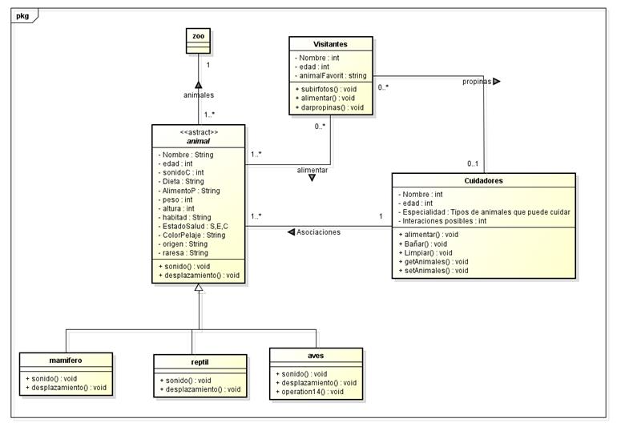

# Laboratorio 02 -SOLID, Patrones de Diseño y UML
**Integrantes**
- Julian Eduardo Arenas Alfonso
- Ramirez Alvarez Tomas Felipe
- Manuel Alejandro Guarnizo 

**Nombre de la rama**
feature/guarnizo_ramirez_arenas_2025-2
---
## Retos completados

# Reto 2
**Descripción**
Este software en Java facilita que los comensales de un restaurante creen su propia hamburguesa eligiendo componentes de
una lista establecida o incorporando ingredientes a medida.

Menú inicial con ingredientes básicos:
- Pan
- Carne
- Queso
- Lechuga
- Tomate
- Salsa especial
- Posibilidad de agregar ingredientes nuevos con su precio.
- Selección de ingredientes mediante entrada por teclado.
- Cálculo del precio total utilizando Java Streams.
- Visualización de la hamburguesa personalizada con sus ingredientes y precio final.
- Función: Agrega un ingrediente a la hamburguesa personalizada, con sus precios que son llave valor

- Procesa la entrada del cliente (los números ingresados) y agrega los ingredientes correspondientes, los ingresa
con "," para poder ingresar todos los ingredientes que guste, cuenta con la opcion de agregar el ingrediente que el
cliente quiera y se le asigna un valor acorde

-Muestra en consola el menú con todos los ingredientes disponibles y sus precios,Genera un resumen del pedido 
(ingredientes seleccionados y precio total).
Cómo se muestra en la imagen:

- Por ultimo terminamos de completar el ultimo metodo que es el main para que funcione el programa se hace con los 
comentarios que se solicitaron en el documento del laboratorio.

# Reto 4
**Descripción**
Una casa de cambio anteriormente pertenecía a un individuo apodado “El Gringo”.
Este personaje efectuaba intercambios monetarios utilizando una única tasa de cambio para todas las divisas (USD, EUR, JPY, COP).
Como resultado, los clientes eran engañados al recibir menos de lo que realmente debían.

El nuevo propietario los ha incorporado a su equipo y les ha encargado que desarrollen un servicio que facilite 
la conversión de cualquier moneda a cualquiera de las utilizadas con la tasa real,como se ve acontinuacion

-**Conversión entre USD, EUR, JPY y COP con tasas reales.

Conversión múltiple: un monto puede cambiarse a varias monedas destino en la misma transacción.
Totales acumulados en cada moneda después de todas las transacciones.

**Formato especial por moneda:**
  - EUR → utiliza , como separador decimal.
  - JPY y COP → sin decimales y separador de miles.
  - USD → dos decimales estándar.
- Asi se aprecia en codigo la conotacion para que se exprese con los estandares que se propusieron en el labortio

- Añadimos eviedentemente un metodo separado para que hiciera la conversion de las monedas dependiendo de cual se le
ingresa y a cual quiere convertir.
-
- Por ultimo pero no menos importante el main para que este proceso de conversion funcione se planteo de la siguiente manera:

# Reto 8
**Descripción**
Este proyecto modela el funcionamiento de un zoológico aplicando principios SOLID, patrones de diseño y diagramas UML.
El objetivo es representar de manera clara las entidades principales (animales, cuidadores, visitantes) y sus 
interacciones dentro del zoológico.

Se definieron cuatro clases principales:

**Zoo:** clase principal que representa al zoológico en general.

**Animal:** interface base que define los atributos y comportamientos comunes.
De esta interface se derivan las clases abstractas que representan las especies principales: Mamíferos, Reptiles y Aves.

**Cuidador:** clase asociada a los animales, con responsabilidades como alimentar, limpiar y bañar.

**Visitante:** clase que se relaciona tanto con los animales (alimentándolos) como con los cuidadores (entregando propinas).
Además, se añadieron métodos relevantes que representan las interacciones entre los actores del zoológico.

**Principios SOLID**

**S (Responsabilidad Única)**: cada clase tiene una función bien definida y no asume responsabilidades que no le corresponden.

**O (Abierto/Cerrado)**: el sistema permite extenderse fácilmente (por ejemplo, agregar nuevas especies de animales) sin
necesidad de modificar las clases existentes.

**L (Sustitución de Liskov)**: cualquier subclase de Animal puede sustituir a la clase superior sin afectar la lógica 
del programa.

**Polimorfismo**
Se aplicó para que los animales pudieran compartir comportamientos comunes (como emitir sonidos o alimentarse), pero 
implementados de forma distinta según cada especie.

**Métodos y Atributos**
Se definieron métodos y atributos alineados con los comportamientos y actividades propias de cada entidad, como alimentar
animales, bañar o limpiar hábitats, dar propinas y registrar interacciones.

